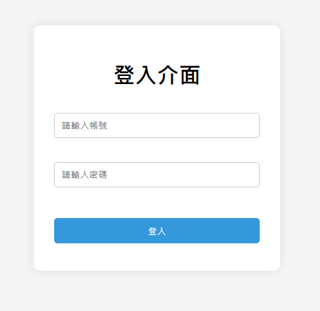
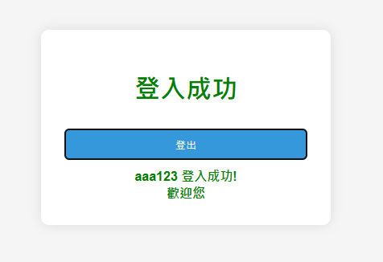
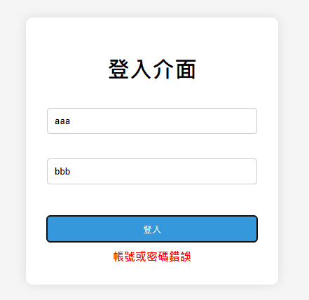
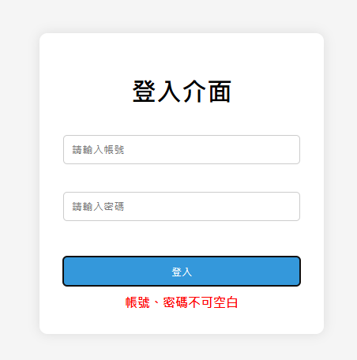
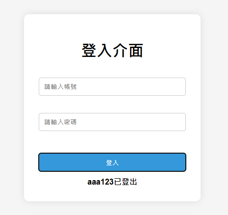

⭐ JS 使用者登入介面練習

簡介:

這是一個使用純HTML+JavaScript製作的使用者登入介面小專案

本練習是我回歸學習前端的第一個作品

功能使用說明:

使用以下帳號密碼進行測試

帳號:aaa123

密碼:a123456

功能包括:

使用者登入 / 登出

帳號或密碼空白提示

錯誤登入提示及狀態切換

✔️HTML ✔️CSS ✔️JavaScript

專案結構:

'''
LoginUI
    ├─ index.html (首頁)
    ├─ script.js (JavaScript)
    ├─ README.md (程式簡介)
    └─screenshot (畫面截圖 for README)
'''

使用方法:

( Git Clone用網址 https://github.com/Frank-Pon/-JS-loginUI.git ) clone之後 ->  直接打開index.html -> 開始使用 ✅

專案學習心得:

職訓結束之後，我比較著重在Python的學習與應用

當時對前端技術 ( 尤其是CSS ) 覺得有點排斥

但是在進入公司後接到的第一個專案是一個「全端專案」

這讓我重新接觸與理解前端的應用及架構

可以讓網頁變得很活潑、有活力真的是太吸引我了

而這個練習，是我決定重新學習前端的第一個完整小作品

雖然是個小專案，但也讓我學到

DOM要怎麼操作還有要怎麼使用JavaScript控制介面邏輯

這真的非常有魅力。

